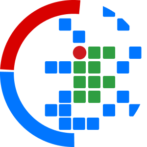

<div align="center">
  
  
  
  
  <!--  -->
  
</div>

# **COTESI** - Congresso de Tecnologia e Sistemas de Informação 

Este é um projeto com ênfase no desenvolvimento de uma plataforma web para apresentação sobre o Congresso de Tecnologia e Sistemas de Informação do IFSP Campus Votuporanga, sendo desenvolvido pela comissão organizadora.

Equipe Organizadora é composta por Professores do IFSP (Campus Votuporanga - https://vtp.ifsp.edu.br/) e Alunos do Curso de Sistemas de Informação 
<br />
* Página oficial - https://cotesi.org

## Descrição

O maior objetivo é o desenvolvimento de uma aplicação web para apresentação do evento, com links para materiais completos, utilizando as tecnologias citadas abaixo:

  
  
  
  

## Utilização

Aprenda como utilizar e testar a plataforma!

### Dependências

  - Algum editor de código de sua preferência;
  - [Git](https://git-scm.com/) previamente instalado;
  - [PHP](https://www.php.net) previamente instalado;
  - [Composer](https://getcomposer.org) instalado como gerenciador de dependências do PHP. Clique [aqui](https://getcomposer.org/download) para visualizar o processo de download e instalação do Composer em seu sistema operacional!
  

### Instalação

Após ter a total certeza de ter todas as dependências previamente definidas, basta clonar o repositório utilizando:

```sh
$ git clone https://github.com/cotesi/cotesi.github.io.git
```

Logo depois de clonarmos o projeto, basta abrir o diretório em seu emulador de terminal e utilizando o composer executar:

```sh
$ composer install
```
> O motivo é simples: o diretório `vendor` é incluído nas configurações do `.gitignore` por padrão, impedindo que configurações sensíveis (variando para cada sistema operacional) possam ser ignoradas em um futuro commit!

Pronto! Agora para testar seu projeto basta utilizar o comando `php` e testar! Um exemplo simples seria executar `php -S localhost:8080` dentro do diretório de seu projeto!

## Contribuindo

1. Realize um fork em (<https://github.com/cotesi/cotesi.github.io/fork>)
2. Crie a branch de sua feature (`git checkout -b feature/novaFeature`)
3. Realize o commit de suas modificações (`git commit -am 'Aqui vai sua descrição'`)
4. Faça o push de suas modificações (`git push origin feature/novaFeature`)
5. Crie uma nova pull request

## Licença

Este projeto é licenciado pela Licença [GPL-3.0 license] - veja o arquivo LICENSE.md para mais informações
